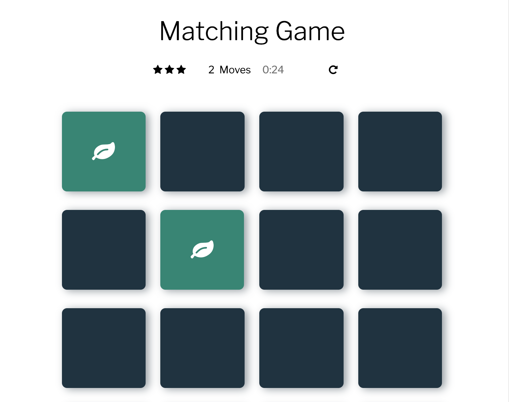

# Memory Game Project
This is the second project in Udacity's Front End Nanodegree program designed to get more hands-on with Javascript & DOM elements.

## Brief
The project is a memory card game. Click around and try to pair cards of the same type. Once you find all the pairs, you've won the game (congrats!). There's a running timer and a star rating based on the number of tries it takes to finish the game.

## Instructions
Open up the project and start clicking! Once you find cards of a similar type, they'll turn green. Once you've found all the pairs, you'll see a success modal, where you can randomize the cards and try again.

### How this was made
Elbow grease, grit, trial, error, tears and resilience. Lots of combing through Javascript documentation, Udacity's webinars, message boards, notebook scrawling and trying out course material.

### Screenshot
